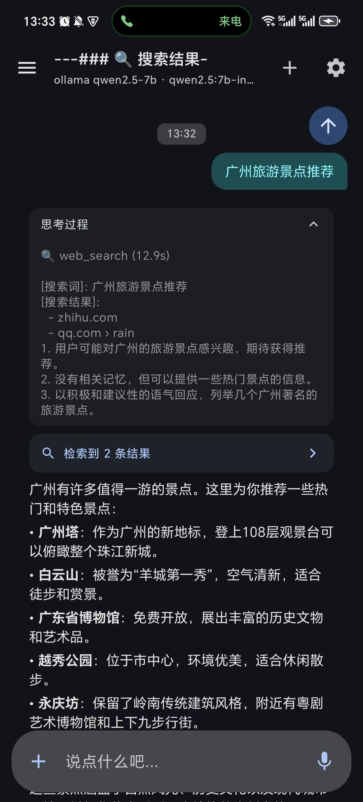
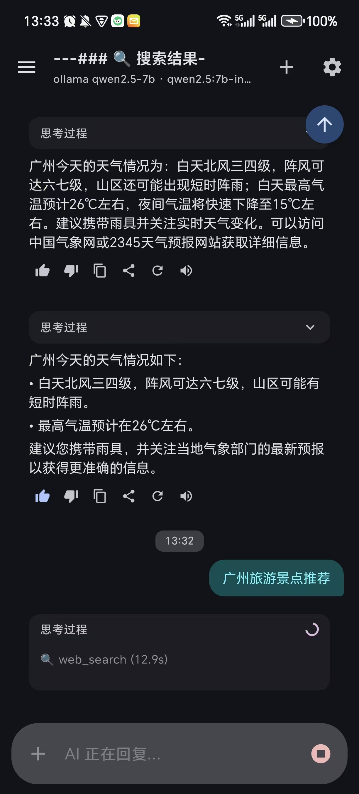
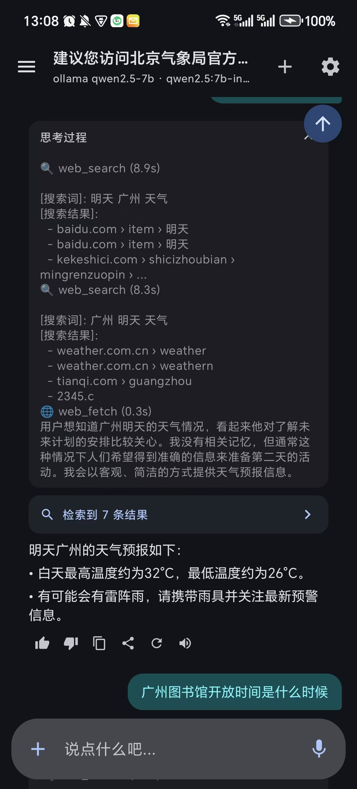
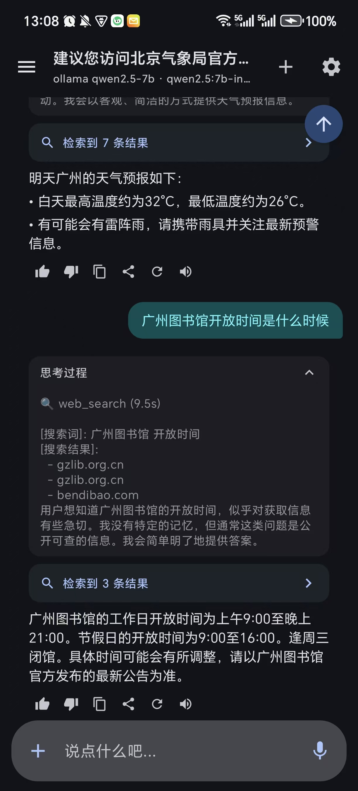

# Paradise Agent — 本地 AI 聊天 Agent 框架

端到端本地 AI Agent 系统：Android 客户端 + Python agent 服务端。支持 ReAct 推理循环、工具调用、网页搜索、语音转文字、TTS 朗读、图片理解、物体检测。

## 功能展示

| 对话 & 思考 | 网页搜索 | 语音转文字 | 设置页 |
|:---:|:---:|:---:|:---:|
|  |  |  |  |

**核心能力**：
- ReAct Agent 推理循环（工具调用 → 思考 → 回复）
- 网页搜索 + Query 改写 + RAG 摘要 + 搜索结果卡片
- 语音转文字（服务端 Whisper + 离线 Vosk 兜底）
- TTS 语音朗读（Android 内置引擎）
- 图片理解（vision_analyze → qwen2.5vl）
- 物体检测（YOLOv8-nano）
- OCR 文字识别（ML Kit 离线）
- 9 个工具自动发现注册

## QuickStart

### 1. 启动 Python Server

```bash
git clone git@github.com:wenkangwei/paradise-agent.git
cd paradise-agent/server
pip install -r requirements.txt

# 启动 server (需先安装 Ollama 并拉取模型)
PYTHONPATH=server NO_PROXY='*' python3 -m uvicorn main:app --host 0.0.0.0 --port 8000
```

### 2. 安装 Ollama 并拉取模型

```bash
# 安装 Ollama (Linux / WSL2)
curl -fsSL https://ollama.com/install.sh | sh

# 拉取模型
ollama pull qwen2.5:7b-instruct     # 对话模型（推荐，支持 tool calling）
ollama pull qwen2.5vl:7b            # 图片理解模型
ollama pull qwen2.5:3b              # 摘要/改写用的小模型
```

### 3. 编译安装 Android App

```bash
cd paradise-agent
./gradlew assembleDebug
# APK: app/build/outputs/apk/debug/app-debug.apk
```

用 adb 安装到手机：
```bash
adb install -r app/build/outputs/apk/debug/app-debug.apk
```

### 4. 配置手机连接

打开 App → 设置 → 模型 API 配置 → 新增：

| 字段 | 值 |
|------|-----|
| 供应商 | Custom |
| Base URL | `http://<PC_IP>:8000/v1/agent/chat/completions` |
| fullUrlMode | 开 |
| 模型名 | `qwen2.5:7b-instruct` |

`<PC_IP>` 替换为电脑的局域网 IP（`ipconfig` 查看）。

> 手机和电脑需在同一 WiFi 下。也可用 ZeroNews / Tailscale / Cloudflare Tunnel 做内网穿透。

### 5. Vosk 离线语音识别（可选）

下载模型推送到手机：
```bash
# 下载 vosk-model-small-cn-0.22.zip 解压后
adb push vosk-model-small-cn-0.22 /sdcard/vosk-model
```

无 Vosk 模型时走服务端 Whisper STT。

## 项目结构

```
paradise-agent/
├── app/                    # Android 客户端 (Kotlin + Compose + Hilt)
│   └── src/main/java/com/example/aichat/
│       ├── data/           # Room DB, API, Mapper, Repository
│       ├── domain/         # Models, UseCase
│       ├── di/             # Hilt DI
│       ├── service/        # :streaming 进程 StreamingService
│       ├── ui/             # Compose UI
│       ├── feature/        # 设置页、语音配置、用户画像
│       └── util/           # CrashReporter, OcrHelper, TTS
├── server/                 # Python Agent Server (FastAPI + paradise)
│   ├── paradise/           # Agent 框架
│   │   ├── core/           # Agent, Channel, Context
│   │   ├── tools/          # 9个自动注册工具
│   │   ├── transports/     # LLM 传输层 (OpenAI/Anthropic/Ollama)
│   │   ├── memory/         # 记忆管理
│   │   ├── prompt/         # Prompt 构造
│   │   ├── heartbeat/      # 心跳机制
│   │   └── reflection/     # 反思引擎
│   ├── api/routes/         # openai_proxy
│   ├── main.py             # FastAPI 入口
│   ├── agent_handler.py    # Agent 会话管理 + SSE
│   ├── context_compactor.py # Token感知上下文压缩
│   ├── model_router.py     # 模型能力检测+路由
│   └── turn_logger.py      # 对话日志+训练数据导出
├── docs/                   # 文档 + 截图
└── SERVER_SYNC_TODO.md     # 开发待办路线图
```

## API 端点

| 端点 | 用途 |
|------|------|
| `GET /api/health` | 健康检查 |
| `POST /v1/chat/completions` | OpenAI 兼容（thin proxy 兜底） |
| `POST /v1/agent/chat/completions` | **Agent 对话** (ReAct loop) |
| `POST /api/stt/transcribe` | Whisper 语音转文字 |
| `GET /v1/models` | 模型列表 |

## 使用示例

### 文本对话
```
输入: 帮我写一段Python快速排序代码
Agent: [思考] → [TOOL: 无] → [RESPOND] → 流式输出代码
```

### 网页搜索
```
输入: 搜索最近AI领域的重要新闻
Agent: [TOOL: web_search] → Query改写 → 多词搜索 → 抓取内容 → RAG摘要
       → 思考框: 搜索词 + 结果列表 → 回复正文 + 搜索结果卡片
```

### 语音输入
```
按住🎤 → 说话 → 松手 → Whisper转文字 → 自动发送
```

### 图片理解
```
⊕ → 拍照 → 描述图片 → vision_analyze → 回复图片描述
```

## Agent 工具集（9个）

| 工具 | 用途 |
|------|------|
| `bash` | 执行 Bash 命令 |
| `read_file` | 读取文件内容 |
| `search_files` | 文件搜索 |
| `vision_analyze` | 图片理解 (qwen2.5vl) |
| `file_parse` | 文件解析 (PDF/DOCX/TXT) |
| `web_search` | 网页搜索 (Bing) + Query改写 + RAG |
| `web_fetch` | 网页内容抓取 |
| `context_expand` | 上下文摘要展开 |
| `yolo_detect` | YOLOv8 物体检测 |

加新工具：在 `server/paradise/tools/` 目录放 `.py` 文件 → 自动发现注册。

## 技术栈

| 层 | 技术 |
|------|------|
| Android UI | Jetpack Compose + Material 3 |
| DI | Hilt + KSP |
| DB | Room v8 (multiInstanceInvalidation) |
| 网络 | OkHttp + SSE + Retrofit |
| 后台 | ForegroundService (dataSync) |
| Server | FastAPI + httpx |
| LLM | Ollama (qwen2.5 + qwen2.5vl) |
| Speech | Whisper (faster-whisper) + Vosk |
| Vision | YOLOv8-nano + ML Kit OCR |
| Agent | Paradise Framework (ReAct loop) |

## 开发路线

详见 [SERVER_SYNC_TODO.md](SERVER_SYNC_TODO.md) — 11项待办含 Planning + Multi-Agent + LoRA异步训练架构。
